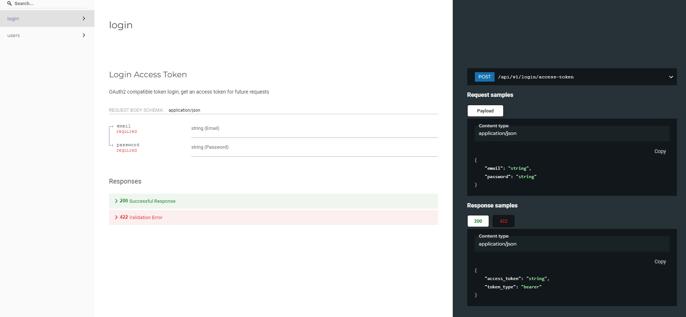

# Marvik project

## Requirements

* [Docker](https://www.docker.com/).
* [Poetry](https://python-poetry.org/) for Python package and environment management.

## Local Deployment

* create new .env with the below structure


```bash
PROJECT_NAME = marvik
POSTGRES_SERVER = db
POSTGRES_USER = postgres
POSTGRES_PASSWORD = mysecretpassword
POSTGRES_DB = app

FIRST_SUPERUSER = kevin
FIRST_SUPERUSER_PASSWORD = 1234

INSTALL_DEV = true
```

* Build the app with Docker Compose:

```bash
docker compose build
```

* Start the app with Docker Compose:

```bash
docker compose up -d
```

* Run the script to set the super admin user

```bash
docker-compose run app sh -c "./prestart.sh"
```

## doc

you can see the documentation on /redoc

